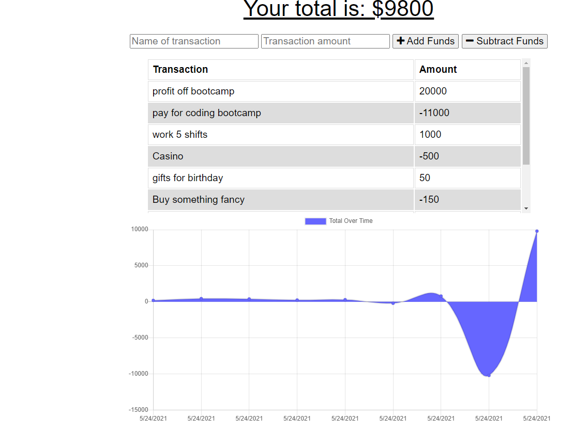
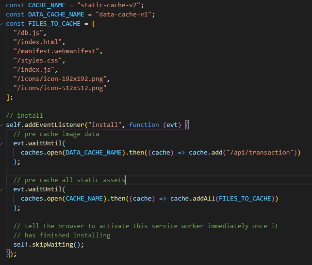
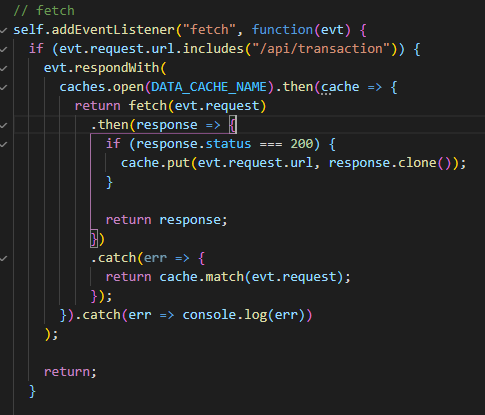

# Budget Tracker

[Description](#description) 

[Ideal User](#ideal-user)

[Installation Instructions](#installation-instructions) 

[Site Overview](#site-overview) 
  

[Contribution Guidelines](#contribution-guidelines) 
 
[Questions](#questions)

## Description

Hosted on Heroku: https://whispering-tor-43687.herokuapp.com/

This app is designed for a user that is interested in keeping track of their spending in order to create an effective budget.  The app is built so that a user can utilize the app without an internet connection and it will to continue to function and populate the offline activity once it goes back online.  

The app was created using HTML, CSS, Express, Javascript, Mongoose and MongoDB.  The offline functionality is achieved through the use of created an indexedDB and utilizing Service Workers.  

## Ideal User

This application is aimed at a user who is looking to 
wants a fast and easy way to track their money at any time
even if they might not have the most stable internet connection.  

## Installation Instructions

No need to install this application! If you want to clone or fork it to your local device feel free, otherwise it is available via github pages and can be found at the following link: https://whispering-tor-43687.herokuapp.com/

## Site Overview

Upon accessing the application from the link above, the user is given the option to log an activity and choose whether this will increment or decrement their total savings.  The savings is displayed using Charts.js and is updated whether the user is online or offline.  

The way that the app remains functional in offline mode is through the use of having an indexedDB and service workers.  The service worker caches the neccessary files to allow the site to render and remain functional.  

From there, Javascript is used to store the information and serve it back to the server once a connection is reestablished so that it no longer only exists on the browsers IndexedDB.  This is done using a fetch command once a connection is reestablished.  

## License

This application uses the MIT license

## Contribution Guidelines

If you would like to contribute to this project feel free to send requests.  I only wish that you be respectful to other contributes and to the code itself and maintain good clean coding practices. 

### Questions

If you have any questions about the application, be sure to contact me at my [e-mail](mailto:smonagha@conncoll.edu).

Alternatively you can find me and my other works at my [Github account](https://github.com/seanmonaghan).
